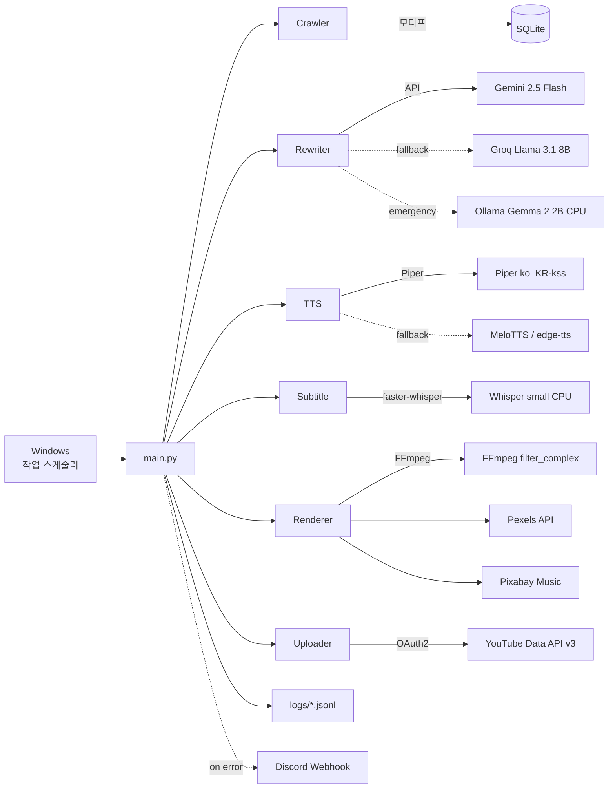
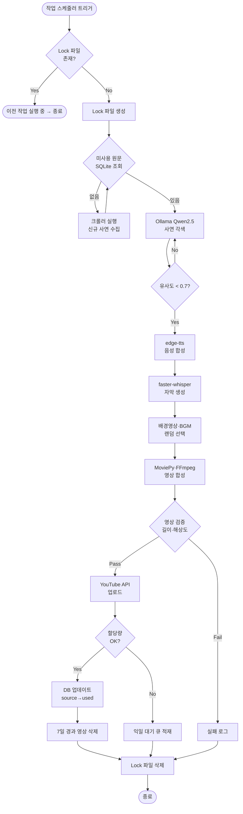
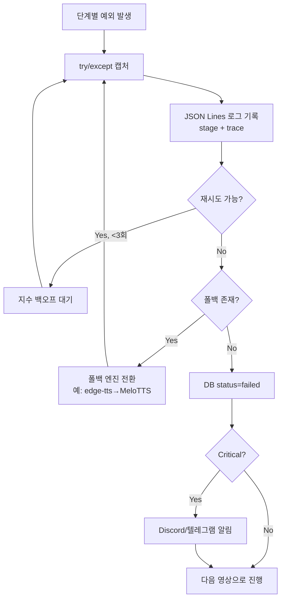
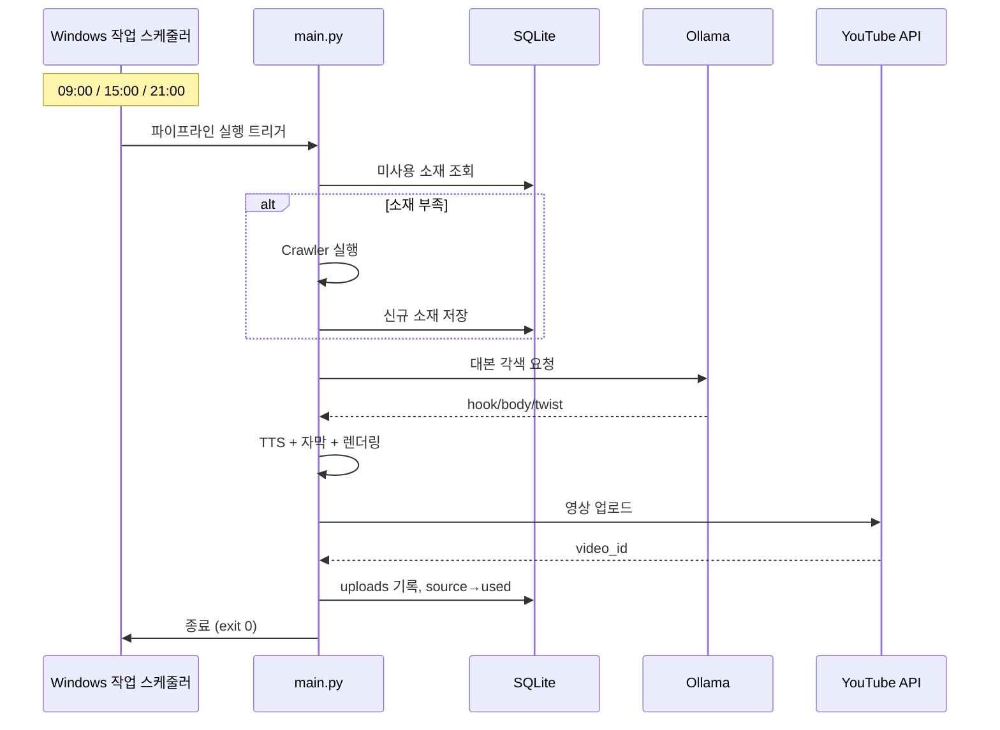

# YouTube Shorts 자동화 시스템 요구사항 정의서

| 항목 | 내용 |
|------|------|
| 프로젝트명 | Shorts Auto Pipeline |
| 작성일 | 2026-04-21 (v1.0 확정: 2026-04-29) |
| 버전 | **v1.0 (Approved)** |
| 작성자 | - |
| 운영 환경 | Windows 11 Pro / 로컬 PC 상시 구동 (NSSM 서비스화), **GPU 미보유 → CPU + 클라우드 무료 API 하이브리드** |
| 예상 월 운영비 | API/SaaS ₩0 (100% 오픈소스 + 무료 API), 전기료 약 **₩5,000/월** (CPU 24h 구동 기준) |

---

## 1. 프로젝트 개요

### 1.1 목적
한국어 기반 **사연·반전 스토리텔링 YouTube Shorts 채널**을 완전 자동화 파이프라인으로 운영하여,
소재 수집부터 업로드까지 **무인 생산·발행** 체계를 구축한다.

### 1.2 배경
- 2026년 YouTube Shorts "배신·복수 내러티브" 니치 YoY 성장률 21x
- 한국어 사연 채널은 2025년 말~2026년 초 성장 단계로 진입 선점 가능
- 오픈소스 LLM·TTS 성숙으로 제로 비용 운영 가능 시점 도래

### 1.3 성공 기준 (KPI)

| 지표 | 3개월 목표 | 6개월 목표 |
|------|-----------|-----------|
| 일 업로드 수 | 3개 | 5개 |
| 구독자 수 | 1,000명 | 10,000명 |
| 평균 시청 지속률 | 55% | 65% |
| 평균 조회수 | 1,000 | 10,000 |
| 운영 투입 시간 | 주 3시간 이하 | 주 1시간 이하 |

### 1.4 범위
**포함 (In-Scope)**
- 사연 소스 크롤링 → 각색 → TTS → 영상 합성 → 자동 업로드
- 로컬 SQLite 기반 소재/메타데이터 관리
- Windows 작업 스케줄러 기반 주기 실행
- 로컬 로그 파일 기반 운영 모니터링

**제외 (Out-of-Scope)**
- 유료 API/SaaS 사용 (Claude/OpenAI/ElevenLabs 등)
- 클라우드 서버 (VPS, AWS, GCP)
- 썸네일/영상 자동 A/B 테스트 (v2에서 검토)
- 댓글 자동 응답 (정책 리스크로 v2에서 검토)
- 다국어 지원 (한국어 전용)

---

## 2. 기능 요구사항 (Functional Requirements)

### FR-1. 소재 수집 (Source Provider)
> **저작권 안전성 우선**: 원문 직접 크롤링은 게시물 저작권(작성자 귀속)·이용약관 위반 리스크가 큼. 아래 우선순위로 운영한다.

| ID | 요구사항 |
|------|--------|
| FR-1.1 | **소재 수급 우선순위**: ① LLM 완전 창작(테마·키워드만 입력) → ② Reddit 공식 API의 CC-BY 호환 서브레딧(`r/tifu`, `r/MaliciousCompliance` 등) → ③ 공공 도메인(전래동화·고전 설화 DB) → ④ 일반 게시판 크롤링은 **모티프만 추출 후 원문 즉시 폐기** |
| FR-1.2 | 크롤링 시 대상 사이트의 `robots.txt`·이용약관을 사전 점검하고, 금지 명시된 사이트는 자동 제외한다 |
| FR-1.3 | 정적 페이지는 `httpx + selectolax`, JS 렌더링이 필요한 페이지만 Playwright를 사용한다 (자원 절약) |
| FR-1.4 | User-Agent 식별 명시 + 도메인별 Rate-Limit (1 req / 3 sec 이상)을 준수한다 |
| FR-1.5 | 중복 방지: ① 원문 SHA-256 해시(정확 일치) + ② sentence-transformers `jhgan/ko-sroberta-multitask` 임베딩 코사인 유사도 0.85 이상이면 중복 처리 |
| FR-1.6 | 모티프(주제·전개·반전 키워드)만 추출하여 SQLite에 저장하고, **원문은 24시간 내 자동 삭제**한다 (저작물 보관 회피) |
| FR-1.7 | 모티프 길이 기준: 200자 이상 1,500자 이내 |
| FR-1.8 | 수집 실패 시 3회까지 지수 백오프 재시도 후 로그 기록 |

### FR-2. 대본 생성 (Rewriter / Creator)
| ID | 요구사항 |
|------|--------|
| FR-2.1 | 모티프(또는 키워드 시드)를 **쇼츠용 60초 대본(한국어 약 250~300자)**으로 창작/각색한다 |
| FR-2.2 | **주력 LLM: Gemini 2.5 Flash 무료 API** (RPM 15 / RPD 1,500). GPU 미보유 환경에서 로컬 LLM 대신 클라우드 무료 API를 1순위로 사용한다. 일 3~5건 영상 기준 호출량은 한도 내 충분 |
| FR-2.3 | **1차 폴백: Groq Llama 3.1 8B-Instant 무료** (RPM 30). **2차 폴백: Ollama + Gemma 2 2B** (Apache 2.0, CPU 추론, 인터넷 단절·전체 클라우드 한도 초과 시 비상용) |
| FR-2.4 | 출력 구조: `{hook(5초), body(45초), twist(10초), title, hashtags[]}` JSON으로 반환 |
| FR-2.5 | 욕설·혐오·특정인 실명·민감 정치/종교 표현 포함 시 자동 마스킹 또는 드롭한다 |
| FR-2.6 | 유사도 임계값 (3중 검증): ① 입력 모티프 대비 < 0.7, ② 과거 30일 업로드 대본 대비 < 0.6, ③ 동일 채널 누적 대본 대비 임의 샘플 100건 평균 < 0.55 |
| FR-2.7 | 후킹 다양성 보장: hook 패턴 풀(질문형/놀람형/숫자형/대화형 등 8종) 중 **순환 강제**, 직전 5개 대본과 동일 패턴 금지 |

### FR-3. 음성 합성 (TTS)
| ID | 요구사항 |
|------|--------|
| FR-3.1 | **다중 엔진 우선순위**: ① **Piper TTS** (MIT, 완전 오프라인, `ko_KR-kss-medium`) → ② edge-tts (비공식, 차단 리스크 인지) → ③ MeloTTS (MIT) |
| FR-3.2 | 화자 다변화: 한국어 화자 풀 5종 이상 보유. edge-tts 사용 시 `ko-KR-SunHiNeural`, `ko-KR-InJoonNeural`, `ko-KR-BongJinNeural`, `ko-KR-JiMinNeural`, `ko-KR-GookMinNeural` 순환 |
| FR-3.3 | **콘텐츠 ID 해시 기반 결정론적 화자 선택**: 동일 대본 재생성 시 동일 화자, 채널 단위 직전 3개와 다른 화자 강제 |
| FR-3.4 | 출력 포맷: mp3, 24kHz, mono, 음량 정규화 -16 LUFS |
| FR-3.5 | 대본 1건당 50~58초 분량으로 생성 (Shorts 60초 한계 안전 마진) |
| FR-3.6 | TTS 실패 시 폴백 체인 자동 전환, 모든 엔진 실패 시 해당 영상 스킵하고 다음 작업으로 진행 |
| FR-3.7 | edge-tts 403/429 응답 누적 5회 발생 시 **24시간 자동 비활성화** + Piper로 강제 전환 |

### FR-4. 자막 생성 (Subtitle)
| ID | 요구사항 |
|------|--------|
| FR-4.1 | **faster-whisper small** (CPU int8) 모델로 음성 → 자막 SRT 생성. GPU 미보유 환경 기준 60초 오디오 처리 30~60초 소요. (GPU 보유 시 large-v3로 업그레이드 가능) |
| FR-4.2 | 자막은 최대 2줄, 줄당 15자 이내로 제한한다 |
| FR-4.3 | 주요 키워드에 강조 효과(색상/크기)를 선택적으로 적용한다 |
| FR-4.4 | 자막 파일은 output/subtitle/*.srt로 저장한다 |

### FR-5. 영상 합성 (Renderer)
| ID | 요구사항 |
|------|--------|
| FR-5.1 | 해상도 **1080x1920 (9:16)**, 30fps, H.264 (CRF 23) + AAC 192k |
| FR-5.2 | 길이는 **최대 58초** (Shorts 60초 한계 안전 마진) |
| FR-5.3 | 구성: 배경영상(루프 + 자동 크롭/색보정/속도 ±5% 랜덤화) + TTS 음성 + 자막(번인) + BGM(-18dB sidechain ducking) |
| FR-5.4 | 배경영상 풀: Pexels API + 로컬 게임플레이/B-roll 녹화본 **최소 100종 캐싱**, 동일 영상 재사용 시 7일 간격 강제 |
| FR-5.5 | BGM 풀: **3-Tier Hybrid 오프라인 풀 빌드** ① **MusicGen** (Apache 2.0, 오프라인 AI 생성 — 매번 unique → Content ID 매칭 0%) + ② **Internet Archive Audio API** (Public Domain 필터) + ③ **YouTube 오디오 라이브러리** (수동 백업) → **최소 30곡 풀 유지**. 업로드 후 Content ID 매칭 자동 검사 + 매칭 곡 즉시 블랙리스트. (Pixabay Music API는 공식 미지원 확인 — 2026-04-29 v1.0 사후 보정) |
| FR-5.6 | 합성 엔진: **FFmpeg `-filter_complex` 직접 호출** (MoviePy는 스크립트 생성 보조 용도). 1080p 60초 렌더링 목표 30초 이내 |
| FR-5.7 | 자막 번인은 `libass` (ASS 포맷) 사용, 키워드 강조 색상은 `\c&H...&` 인라인 태그로 적용 |
| FR-5.8 | 영상 검증: 길이/해상도/오디오 트랙 존재/평균 음량(-16~-14 LUFS) 자동 체크, 실패 시 재렌더링 1회 |
| FR-5.9 | 합성 실패 시 오류 로그 기록 후 다음 작업으로 진행 |

### FR-6. 업로드 (Uploader)
| ID | 요구사항 |
|------|--------|
| FR-6.1 | **YouTube Data API v3**를 사용하여 업로드한다 |
| FR-6.2 | OAuth 2.0 refresh_token을 로컬 암호화 저장하여 재인증 없이 사용 |
| FR-6.3 | 제목은 LLM이 생성한 후킹 문구 + `#Shorts` 고정 포함 |
| FR-6.4 | 설명: 대본 요약(150자) + 해시태그 5개 + 면책 문구 |
| FR-6.5 | 카테고리는 `People & Blogs (22)` 또는 `Entertainment (24)` |
| FR-6.6 | `madeForKids=false`, `selfDeclaredMadeForKids=false` 명시 |
| FR-6.7 | API 할당량(일 10,000 units, 업로드 1건당 ~1,600 units → 일 6건 이론 한계) 초과 시 대기 큐에 적재 후 KST 00:00 리셋 시점 재시도 |
| FR-6.8 | **AI 생성 콘텐츠 공시 (다층 적용)**: ① 영상 설명란 첫 줄에 "본 영상은 AI 음성·각색을 사용했습니다" 자동 삽입 ② 해시태그에 `#AI` 또는 `#AIVoice` 포함 ③ Studio UI의 "altered/synthetic content" 토글은 Data API에서 제어 불가하므로 **Playwright 자동화로 업로드 후 자동 체크** (스튜디오 로그인 세션 재사용) |
| FR-6.9 | 업로드 간격을 ±20분 이내 랜덤화하여 봇 패턴 회피 (예: 09:00 → 08:42~09:18) |
| FR-6.10 | 채널 확장 시 OAuth 클라이언트 분리 (채널당 quota 독립), 클라이언트 ID는 `config.yaml`에서 다중 등록 |

### FR-7. 스케줄링 (Scheduler)
| ID | 요구사항 |
|------|--------|
| FR-7.1 | **Windows 작업 스케줄러**로 일 3회 파이프라인 실행 (09:00 / 15:00 / 21:00) |
| FR-7.2 | 1회 실행당 영상 1개 생성·업로드 |
| FR-7.3 | PC 절전 모드 중에도 작업이 깨어나도록 `Wake Computer` 옵션 활성화 |
| FR-7.4 | 중복 실행 방지를 위한 Lock 파일 관리 |

### FR-8. 로깅·모니터링 (Observability)
| ID | 요구사항 |
|------|--------|
| FR-8.1 | 모든 단계별 로그를 `logs/YYYY-MM-DD.log`에 JSON Lines 포맷으로 기록 |
| FR-8.2 | 실패 시 `logs/errors/` 별도 저장 + 사유·트레이스백 포함 |
| FR-8.3 | 일일 요약 리포트(업로드 수/실패 수/총 소요 시간) 자동 생성 |
| FR-8.4 | Discord Webhook 또는 텔레그램 봇으로 에러 알림 송출 (선택) |

---

## 3. 비기능 요구사항 (Non-Functional Requirements)

### 3.1 성능
| 항목 | 목표치 |
|------|-------|
| 1영상 end-to-end 생성 시간 | **8~10분 이내** (CPU 기준, Whisper small + Piper + FFmpeg) |
| 동시 처리 건수 | 1건 (순차 처리) |
| 디스크 사용량 | 월 10GB 이내 (영상 7일 보관 후 자동 삭제) |
| 인터넷 의존도 | 높음 (Gemini/Groq API 호출 필수, 단절 시 Ollama CPU 폴백) |

### 3.2 안정성
- 파이프라인 단계별 독립 트랜잭션 (한 단계 실패해도 다른 영상 작업은 진행)
- 모든 외부 호출(API, LLM, 크롤링)에 타임아웃 + 재시도 정책
- SQLite WAL 모드 사용으로 동시성 안전성 확보

### 3.3 보안
- API 키·OAuth 토큰은 `.env` + Windows DPAPI 암호화 저장
- `.env`, `token.json`, `credentials.json`은 `.gitignore` 필수 등록
- 로그에 민감정보(토큰, 개인정보) 미노출

### 3.4 유지보수성
- 모듈별 단일 책임 원칙 (crawler/rewrite/tts/render/upload 분리)
- `config.yaml`에서 프롬프트·화자·업로드 시간 등 수정 가능
- 단위 테스트 핵심 모듈 최소 1개씩 작성

### 3.5 법적·정책 준수

#### 3.5.1 YouTube 정책 (2025.07 강화 시행 기준)
- **Mass-produced & Repetitive Content 정책**: AI 대량 생성 콘텐츠 수익화 박탈 + 채널 정지 가능 → 화자/배경/BGM/오프닝/제목 패턴 다변화 필수
- **AI 생성 콘텐츠 공시**: 설명란 + 해시태그 + Studio UI altered content 토글 (FR-6.8 참조)
- **Shorts 스팸·중복 정책**: 동일/유사 영상 반복 업로드 금지 → 유사도 다중 검증 (FR-2.6)
- **Community Guidelines**: 폭력·혐오·미성년자 유해 콘텐츠 자동 필터 (FR-2.5)

#### 3.5.2 저작권·이용약관
- 크롤링 대상 사이트 `robots.txt` + 이용약관 자동 점검 (FR-1.2)
- 원문 24시간 내 폐기, 모티프만 보관 (FR-1.6)
- 모든 에셋(BGM·배경영상·폰트)은 **상업 이용 가능 라이선스** 검증 후 풀에 추가
- BGM Content ID 매칭 자동 모니터링 (FR-5.5)

#### 3.5.3 AI 생성 콘텐츠 자체 가이드라인
- **금지 주제**: 실존 인물 사칭, 가짜 뉴스, 의료/법률/금융 자문, 음모론, 미성년자 관련 자극적 소재
- **권장 주제**: 가상 인물 사연, 일상 에피소드, 교훈성 짧은 이야기, 공공 도메인 설화 재구성
- LLM 시스템 프롬프트에 위 가이드라인 명시 + 출력 검증 단계 추가

#### 3.5.4 일일 자동 컴플라이언스 체크
| 체크 항목 | 임계값 | 위반 시 동작 |
|----------|--------|-------------|
| 직전 30일 대본 평균 유사도 | < 0.6 | 업로드 중단 + 알림 |
| 동일 화자 연속 사용 | ≤ 3건 | 강제 화자 변경 |
| 동일 배경영상 재사용 간격 | ≥ 7일 | 자동 우회 선택 |
| YouTube Studio 정책 경고 수신 | 0건 유지 | 발생 시 즉시 Kill-Switch (§12.2) |

---

## 4. 시스템 아키텍처

### 4.1 컴포넌트 다이어그램



### 4.2 기술 스택 (최종, GPU 미보유 기준)

| 계층 | 기술 | 라이센스 | 비고 |
|------|------|----------|------|
| 언어 | Python 3.11+ | PSF | |
| **LLM 주력** | **Gemini 2.5 Flash API** | 무료 티어 (RPD 1,500) | 대본 각색 1순위 |
| LLM 1차 폴백 | Groq Llama 3.1 8B-Instant | 무료 티어 (RPM 30) | API 폴백 |
| LLM 2차 폴백 | Ollama + Gemma 2 2B | Apache 2.0 | CPU 추론, 비상용 |
| TTS (주) | Piper TTS (ko_KR-kss-medium) | MIT | CPU 친화적, 완전 오프라인 |
| TTS (1차 폴백) | MeloTTS | MIT | CPU 동작 |
| TTS (2차 폴백) | edge-tts | 비공식 | 차단 리스크 인지 |
| STT | faster-whisper small (CPU int8) | MIT | 60초 오디오 30~60초 처리 |
| 임베딩 | sentence-transformers (ko-sroberta) | Apache 2.0 | CPU 동작 |
| 영상 합성 | FFmpeg filter_complex | LGPL | MoviePy는 보조 |
| 크롤링 | httpx + selectolax (정적), Playwright (동적) | BSD/Apache 2.0 | |
| DB | SQLite3 (WAL 모드) | Public Domain | 내장 |
| 업로드 | google-api-python-client + Playwright | Apache 2.0 | Studio UI 토글 자동화 포함 |
| 스케줄링 | Windows 작업 스케줄러 + NSSM | MS 내장 / Public Domain | |
| 스톡영상 | Pexels API | 무료 (200req/h) | |
| 음악 | Pixabay Music API + YouTube 오디오 라이브러리 | 무료 | |
| 폰트 | Pretendard, 눈누, 구글 폰트 | 상업 이용 가능 | |

---

## 5. 데이터 모델 (SQLite)

```sql
-- 수집된 원문 사연
CREATE TABLE sources (
    id INTEGER PRIMARY KEY AUTOINCREMENT,
    source_site TEXT NOT NULL,         -- 'nate', 'reddit' ...
    url TEXT NOT NULL,
    title TEXT,
    raw_text TEXT NOT NULL,
    text_hash TEXT UNIQUE NOT NULL,    -- MD5, 중복 차단
    length INTEGER,
    crawled_at TIMESTAMP DEFAULT CURRENT_TIMESTAMP,
    status TEXT DEFAULT 'new'          -- new / used / rejected
);

-- 각색된 대본
CREATE TABLE scripts (
    id INTEGER PRIMARY KEY AUTOINCREMENT,
    source_id INTEGER REFERENCES sources(id),
    hook TEXT,
    body TEXT,
    twist TEXT,
    full_text TEXT,
    similarity REAL,                   -- 원문 대비 유사도
    model_used TEXT,                   -- 'qwen2.5', 'gemini-flash'
    created_at TIMESTAMP DEFAULT CURRENT_TIMESTAMP
);

-- 생성된 영상
CREATE TABLE videos (
    id INTEGER PRIMARY KEY AUTOINCREMENT,
    script_id INTEGER REFERENCES scripts(id),
    audio_path TEXT,
    subtitle_path TEXT,
    video_path TEXT,
    duration_sec REAL,
    rendered_at TIMESTAMP DEFAULT CURRENT_TIMESTAMP
);

-- 업로드 결과
CREATE TABLE uploads (
    id INTEGER PRIMARY KEY AUTOINCREMENT,
    video_id INTEGER REFERENCES videos(id),
    youtube_id TEXT,                   -- 업로드 성공 시 YouTube video id
    title TEXT,
    description TEXT,
    status TEXT,                       -- success / failed / quota_exceeded
    error_msg TEXT,
    uploaded_at TIMESTAMP DEFAULT CURRENT_TIMESTAMP
);

-- 작업 로그
CREATE TABLE job_logs (
    id INTEGER PRIMARY KEY AUTOINCREMENT,
    run_id TEXT,                       -- 배치 실행 ID
    stage TEXT,                        -- crawl / rewrite / tts / render / upload
    status TEXT,                       -- ok / fail
    message TEXT,
    duration_ms INTEGER,
    logged_at TIMESTAMP DEFAULT CURRENT_TIMESTAMP
);
```

---

## 6. 절차 Flow (Process Flow)

### 6.1 전체 파이프라인 (정상 경로)



### 6.2 에러 처리 플로우



### 6.3 일일 운영 사이클



---

## 7. 프로젝트 디렉토리 구조

```
d:\Application\Claude\shorts_auto\
├── docs\
│   ├── REQUIREMENTS.md           # 본 문서
│   ├── SETUP.md                  # 설치 가이드 (작성 예정)
│   └── OPERATIONS.md             # 운영 매뉴얼 (작성 예정)
├── src\
│   ├── __init__.py
│   ├── main.py                   # 파이프라인 오케스트레이터
│   ├── config.py                 # 설정 로더
│   ├── db.py                     # SQLite 래퍼
│   ├── crawler\
│   │   ├── base.py
│   │   ├── nate.py
│   │   └── reddit.py
│   ├── rewriter\
│   │   ├── ollama_client.py
│   │   └── gemini_client.py
│   ├── tts\
│   │   ├── edge_tts_engine.py
│   │   └── melo_engine.py
│   ├── subtitle\
│   │   └── whisper_engine.py
│   ├── renderer\
│   │   ├── composer.py
│   │   └── assets.py
│   ├── uploader\
│   │   └── youtube.py
│   ├── utils\
│   │   ├── logging.py
│   │   ├── similarity.py
│   │   └── lock.py
│   └── notify\
│       └── discord_webhook.py
├── tests\
│   └── test_*.py
├── assets\
│   ├── bg_video\                 # 배경영상 풀
│   ├── bgm\                      # BGM 풀
│   └── fonts\                    # 자막 폰트
├── output\
│   ├── scripts\
│   ├── audio\
│   ├── subtitle\
│   └── final\                    # 최종 업로드용 영상 (7일 후 삭제)
├── logs\
│   ├── 2026-04-21.jsonl
│   └── errors\
├── prompts\
│   └── story_rewrite.txt
├── data\
│   └── shorts.db                 # SQLite 파일
├── .env                          # API 키 (.gitignore)
├── .env.example
├── .gitignore
├── config.yaml
├── requirements.txt
├── pyproject.toml
└── README.md
```

---

## 8. 환경 구성 요구사항

### 8.1 하드웨어 (현재 운영 기준: GPU 미보유)
| 항목 | 최소 | 권장 | 비고 |
|------|------|------|------|
| CPU | 4코어 | **6코어 이상 (필수에 가까움)** | FFmpeg 인코딩 + Whisper CPU 추론 부하 |
| RAM | 16GB | 32GB | Whisper small ~2GB + Ollama Gemma 2B ~2GB + FFmpeg ~2GB |
| GPU | **불필요** | (선택) NVIDIA RTX 3060 12GB | 보유 시 Whisper large-v3 + 로컬 LLM 가능 |
| 저장 | SSD 256GB | SSD 500GB | OneDrive 동기화 폴더 외부에 `data/`·`output/` 배치 필수 |
| 전력 | - | UPS 권장 | 정전 시 SQLite 손상 방지 |
| 인터넷 | 안정적 광대역 | - | Gemini/Groq API 의존, 단절 시 Ollama CPU 폴백 |

> **CPU 환경 주의**: 1영상 end-to-end 8~10분 소요. Whisper large-v3는 CPU에서 실용적이지 않으므로 small/base 권장. 로컬 LLM이 꼭 필요하면 Gemma 2 2B(~2GB) 또는 Phi-3 mini만 가능.

### 8.2 소프트웨어 사전 설치
- Windows 11 Pro (자동 업데이트 시간을 03:00~05:00로 고정 권장)
- Python 3.11+ (3.12 권장)
- FFmpeg (`winget install Gyan.FFmpeg`)
- Ollama (`winget install Ollama.Ollama`) — CPU 폴백용 (Gemma 2 2B)
- Piper TTS 바이너리 + 한국어 음성 모델 (`ko_KR-kss-medium`) — 주력 TTS
- Git for Windows
- Visual C++ Redistributable (`winget install Microsoft.VCRedist.2015+.x64`) — Whisper 의존성
- **NSSM** (Non-Sucking Service Manager) — Python 파이프라인을 Windows 서비스로 등록하여 절전/재부팅 무관 동작
- Playwright + Chromium (`playwright install chromium`) — Studio UI AI 공시 토글 자동화용

### 8.3 외부 계정·API
| 서비스 | 목적 | 비용 |
|--------|------|------|
| Google Cloud Console | YouTube Data API v3 OAuth | 무료 |
| Google AI Studio | Gemini 무료 API 키 | 무료 |
| Pexels | 배경영상 API | 무료 |
| Pixabay | BGM API | 무료 |
| Discord Webhook | 에러 알림 (선택) | 무료 |

---

## 9. 마일스톤 (4주 로드맵)

| 주차 | 목표 | 산출물 |
|------|------|--------|
| 1주 | 환경 구축 + 소재 DB | Ollama 구동, 네이트판 크롤러, SQLite 스키마, 사연 500건 수집 |
| 2주 | 파이프라인 end-to-end | rewriter/tts/subtitle/renderer 연결, 수동 실행 영상 5개 생성 |
| 3주 | 업로드 + 자동화 | YouTube API 연동, 작업 스케줄러 등록, 일 3회 무인 업로드 시작 |
| 4주 | 관측·튜닝 | 로그 분석, 프롬프트 개선, 평균 시청 지속률 기반 A/B 튜닝 |

---

## 10. 리스크 및 대응 방안

### 10.1 핵심 리스크
| ID | 리스크 | 영향 | 발생 확률 | 대응 방안 |
|----|-------|------|----------|----------|
| R1 | YouTube API 할당량 초과 | 업로드 중단 | 중 | 일 6건 이내 운영, 채널 분리(OAuth 클라이언트 다중화)로 확장. AI 채널은 quota 증설 거절 가능성 높음 |
| R2 | AI 생성 공시 누락 | 정책 위반·수익화 거부 | 중 | 설명/태그/Studio UI 3중 적용 (FR-6.8) |
| R3 | **반복 콘텐츠로 채널 정지** (2025.07 정책 강화) | **치명** | **중** | 유사도 3중 검증 + 화자/배경/BGM/훅 패턴 강제 다변화 + 일일 컴플라이언스 체크 (§3.5.4) |
| R4 | 크롤링 저작권/약관 위반 | 법적 리스크·계정 차단 | 중 | LLM 완전 창작 우선, 모티프만 보관·원문 즉시 폐기 (FR-1) |
| R5 | edge-tts 비공식 차단 | TTS 중단 | 중 | Piper TTS 주력 승격, edge-tts는 보조 |
| R6 | VRAM 동시 로딩 충돌 | 렌더링 실패 | 중 | 모델 다운그레이드 (Gemma 9B + Whisper medium) 또는 단계별 언로드 |
| R7 | 크롤링 대상 사이트 차단 | 소재 고갈 | 저 | LLM 창작 우선이라 영향 작음 |
| R8 | 로컬 PC 장애 | 파이프라인 정지 | 저 | UPS + 일간 SQLite 백업 + Discord 알림 |
| R9 | 저작권 분쟁(BGM/영상) | 영상 블록·스트라이크 | 저 | Pixabay/YT 라이브러리만 사용 + Content ID 모니터링 |

### 10.2 운영·인프라 리스크 (보강)
| ID | 리스크 | 대응 방안 |
|----|-------|----------|
| A1 | DPAPI 단독 암호화는 계정 탈취 시 무효 | `age` 또는 GPG 비대칭 암호화 + 부팅 시 1회 passphrase 입력 |
| A2 | SQLite WAL 파일이 OneDrive 동기화와 충돌 | `data/`, `output/`을 OneDrive 제외 폴더로 강제, `wal_autocheckpoint=1000` 설정 |
| A3 | Gemini 무료 티어 RPM 15 / RPD 1,500 초과 | 토큰 버킷 + 분당 10건 미만 자율 제한 |
| A4 | Windows 절전/Wake가 BIOS·그룹 정책으로 무시됨 | NSSM으로 Python을 Windows 서비스화 (절전 무관 동작) |
| A5 | 로그에 토큰/PII 노출 | `structlog` + 정규식 마스킹 프로세서 필수 (`refresh_token`, `Authorization`, 이메일 등) |
| A6 | Pexels/Pixabay API 시간당 호출 제한 | 에셋 풀 ≥ 500개 사전 캐싱, 신규 다운로드는 일 50건 이내 |
| A7 | 동일 배경영상 루프 자체가 반복 패턴 플래그 | 풀 ≥ 100종 + 자동 크롭/색보정/속도 ±5% 랜덤화 |
| A8 | Playwright 자원 점유 큼 | 정적 페이지는 `httpx + selectolax`, JS 필수 페이지만 Playwright |
| A9 | 초기 Shadow-ban 무자각 | YouTube Analytics API 병행 → CTR/노출 급락 시 자동 업로드 중단 (Kill-Switch §12.2) |
| A10 | BGM Content ID 사후 매칭 | 업로드 10분 후 자동 스캔, 매칭 시 해당 BGM 즉시 블랙리스트 + 영상은 비공개 전환 검토 |
| A11 | Studio UI 자동화(Playwright)가 UI 변경 시 깨짐 | UI 셀렉터를 `config.yaml`에 외부화, 실패 시 알림 + 수동 토글 폴백 |
| A12 | 정전·BSOD로 SQLite 트랜잭션 손상 | UPS + WAL + 일간 `.backup` 명령 백업 (7일 보관) |

---

## 11. 승인·변경 관리

### 11.1 승인
- 본 요구사항 정의서는 설계·구현 착수 전 최종 검토 후 v1.0 확정
- 구현 중 요구사항 변경 시 v1.x로 개정 + 변경 이력 관리

### 11.2 변경 이력
| 버전 | 일자 | 변경 내용 | 작성자 |
|------|------|----------|--------|
| v0.1 (draft) | 2026-04-21 | 초안 작성 | - |
| v0.2 (review) | 2026-04-28 | 정책 리스크 검토 반영: ① FR-1 라이선스 클린 소스 전환, ② FR-2 LLM 모델 다운그레이드(Gemma 9B/Qwen 7B) + 유사도 3중 검증, ③ FR-3 Piper TTS 주력화 + 화자 다변화, ④ FR-5 FFmpeg 직접 호출, ⑤ FR-6.8 AI 공시 다층 적용, ⑥ §3.5 정책 준수 체크리스트, ⑦ §10 리스크 A1~A12 보강, ⑧ §12 Kill-Switch, §13 운영비 재산정 신규 추가 | Review |
| **v1.0 (Approved)** | **2026-04-29** | **운영 환경 확정 반영: ① GPU 미보유 → LLM 주력 Gemini Flash로 전환 + Groq 1차 폴백 + Ollama Gemma 2B CPU 비상 폴백, ② Whisper small CPU로 다운그레이드, ③ §3.1 성능 목표 5분→8~10분, ④ §4.2 기술 스택 표 재배치, ⑤ §7 디렉토리 경로 정정 (Codex→Claude), ⑥ §8.1 하드웨어 GPU "불필요"로 변경, ⑦ §13 비용 ₩15,000→₩5,000, ⑧ 본 항목 v1.0 확정 라벨링** | User Approval |

> **상세 변경이력은 `docs/CHANGELOG.md`, 작업 진행 일지는 `docs/WORKLOG.md`에서 관리한다.**

---

## 12. 운영 Kill-Switch

### 12.1 자동 중단 조건 (모두 OR 조건)
| 트리거 | 임계값 | 동작 |
|-------|-------|------|
| 7일 연속 평균 CTR | < 1% | 업로드 중단 + 알림, 프롬프트 재튜닝 필요 |
| 7일 연속 평균 시청 지속률 | < 30% | 업로드 중단 + 알림 |
| YouTube Studio 정책 경고 수신 | ≥ 1건 | **즉시 전체 중단**, 수동 검토 후 재개 |
| 일일 업로드 실패율 | > 50% (2일 연속) | 업로드 중단, 시스템 점검 모드 진입 |
| 누적 대본 평균 유사도 | ≥ 0.6 | rewriter 프롬프트 자동 재시드 + 24h 업로드 중단 |
| BGM Content ID 매칭율 | > 10% (월 단위) | BGM 풀 전수 재검증 |

### 12.2 Kill-Switch 동작
1. `data/killswitch.flag` 파일 생성 → `main.py`가 부팅 시 검사하여 즉시 종료
2. Discord/텔레그램 Webhook으로 사유 즉시 송출
3. 마지막 N건 영상은 자동으로 비공개(privacy=`private`) 전환 옵션 (선택)
4. 해제는 **수동 명령**(`python -m src.main --resume`)으로만 가능

---

## 13. 운영 비용 재산정

### 13.1 직접 비용 (GPU 미보유 기준)
| 항목 | 월 비용 | 비고 |
|------|--------|------|
| API/SaaS | ₩0 | 100% 무료 티어 + 오픈소스 |
| 전기료 (CPU only 24h) | ₩3,000~6,000 | 평균 60W × 720h × ₩100/kWh |
| 인터넷 추가 비용 | ₩0 | 기존 회선 활용 |
| 도메인/스토리지 | ₩0 | 로컬 SSD |
| **합계** | **약 ₩5,000/월** | GPU 추가 시 +₩10,000~15,000 |

### 13.2 간접 비용·기회 비용
- 초기 셋업 시간: 약 4주 (§9 마일스톤)
- 주간 모니터링·튜닝: 주 1~3시간
- PC 점유로 인한 다른 작업 제약 (게임/렌더링 등)

---

## 14. 부록

### 14.1 참고 자료
- YouTube Data API v3 공식 문서
- YouTube 채널 수익 창출 정책 (Mass-produced & Repetitive Content) — 2025.07 시행
- Ollama 공식 문서
- Piper TTS: https://github.com/rhasspy/piper
- edge-tts GitHub: https://github.com/rany2/edge-tts
- MeloTTS GitHub: https://github.com/myshell-ai/MeloTTS
- faster-whisper GitHub: https://github.com/SYSTRAN/faster-whisper
- NSSM (서비스화): https://nssm.cc/
- ko-sroberta (한국어 임베딩): https://huggingface.co/jhgan/ko-sroberta-multitask

### 14.2 용어 정의
| 용어 | 설명 |
|------|------|
| Shorts | YouTube 60초 이하 세로 영상 (9:16) |
| CPM | Cost Per Mille, 1,000회 노출당 광고 수익 |
| RPM | Revenue Per Mille, 크리에이터 실수령 기준 |
| TTS | Text-to-Speech, 텍스트→음성 합성 |
| STT | Speech-to-Text, 음성→텍스트 전사 |
| 할당량(Quota) | YouTube API 일 사용 제한 단위 |
| 번인(Burn-in) | 자막을 영상에 영구 합성하는 방식 |

---

**본 문서는 구현 전 필수 승인 대상이며, 승인 후 `src/` 이하 실제 구현 작업을 착수한다.**
