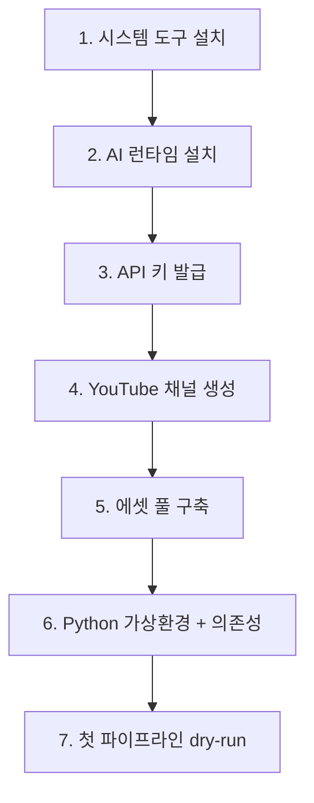

# Setup Guide (사전 준비 가이드)

| 항목 | 값 |
|------|---|
| 대상 환경 | Windows 11 Pro, **GPU 미보유 (CPU only)** |
| 기준 요구정의 | `REQUIREMENTS.md` v1.0 |
| 작성일 | 2026-04-29 |

---

## 0. 진행 흐름



각 단계는 **승인 후 다음 단계로 진행**한다.

---

## 1. 시스템 도구 설치 체크리스트

아래 항목별로 **이미 설치됨 / 신규 설치 필요 / 스킵**을 결정하고 진행한다.

| # | 항목 | 확인 명령 | 설치 명령 |
|---|------|----------|----------|
| 1.1 | Python 3.11+ | `python --version` | https://www.python.org/downloads/ |
| 1.2 | Git for Windows | `git --version` | `winget install Git.Git` |
| 1.3 | FFmpeg | `ffmpeg -version` | `winget install Gyan.FFmpeg` |
| 1.4 | Visual C++ Redistributable | (Whisper 의존성) | `winget install Microsoft.VCRedist.2015+.x64` |
| 1.5 | Ollama (CPU 폴백용) | `ollama --version` | `winget install Ollama.Ollama` |
| 1.6 | Piper TTS 바이너리 | `piper --version` | https://github.com/rhasspy/piper/releases |
| 1.7 | Piper 한국어 모델 | 파일 존재 확인 | https://huggingface.co/rhasspy/piper-voices |
| 1.8 | NSSM (서비스화 단계용, 후순위) | `nssm version` | https://nssm.cc/download |

> **설치 후 PATH 등록**을 반드시 확인한다 (`ffmpeg`, `piper`, `ollama` 가 새 터미널에서 실행되어야 함).

### 1.6 Piper 바이너리 설치 상세
1. https://github.com/rhasspy/piper/releases 에서 `piper_windows_amd64.zip` 다운로드
2. `D:\Tools\piper\` 등에 압축 해제
3. 시스템 환경변수 `PATH`에 위 경로 추가
4. `piper --help`로 동작 확인

### 1.7 Piper 한국어 음성 모델 다운로드
1. https://huggingface.co/rhasspy/piper-voices/tree/main/ko/ko_KR/kss/medium
2. `ko_KR-kss-medium.onnx` 와 `ko_KR-kss-medium.onnx.json` 두 파일 다운로드
3. 프로젝트 폴더 `models/piper/` 에 저장 (구현 단계에서 생성 예정)

### 1.5 Ollama 비상 폴백 모델 다운로드 (선택, 후순위)
인터넷 단절 또는 Gemini/Groq 양쪽 한도 초과 시에만 사용.
```
ollama pull gemma2:2b
```
- 모델 크기: 약 1.6GB
- 첫 호출 시 ~10초, 이후 캐시 시 정상 응답

---

## 2. Python 가상환경 (구현 진입 직전 단계)

```powershell
cd d:\Application\Claude\shorts_auto
python -m venv .venv
.venv\Scripts\activate
pip install --upgrade pip wheel
pip install -r requirements.txt
playwright install chromium
```

`requirements.txt`는 코드 스켈레톤 작성 시 함께 생성된다.

---

## 3. API 키 발급 가이드

> 발급한 키는 모두 **`.env` 파일**(프로젝트 루트, `.gitignore` 등록 대상)에 저장한다.
> 절대 `config.yaml`이나 코드에 직접 작성하지 않는다.

### 3.1 YouTube Data API v3 (필수, FR-6)
**용도:** 영상 자동 업로드

1. https://console.cloud.google.com/ 접속 → 신규 프로젝트 생성 (예: `shorts-auto`)
2. **API 및 서비스 → 라이브러리** → "YouTube Data API v3" 검색 → **사용 설정**
3. **OAuth 동의 화면** 구성:
   - 사용자 유형: **외부**
   - 앱 이름: `Shorts Auto Pipeline`
   - 사용자 지원 이메일: 본인 Gmail
   - 범위: `https://www.googleapis.com/auth/youtube.upload`, `https://www.googleapis.com/auth/youtube`
   - 테스트 사용자에 본인 Gmail 추가
4. **사용자 인증 정보 만들기 → OAuth 클라이언트 ID**:
   - 애플리케이션 유형: **데스크톱 앱**
   - 이름: `shorts-auto-desktop`
   - 생성 후 JSON 다운로드 → `credentials/client_secret.json`로 저장 (디렉토리 미존재 시 신규 생성)
5. 무료 한도: **일 10,000 units** (업로드 1건 ≈ 1,600 units → 일 6건 한계)
6. `.env`에는 OAuth refresh_token이 첫 인증 후 자동 저장된다. (코드에서 처리 예정)

### 3.2 Gemini API (필수, FR-2 주력)
**용도:** 대본 각색 1순위 LLM

1. https://aistudio.google.com/ 접속 → Google 계정 로그인
2. 좌측 상단 **"Get API key"** 클릭
3. **"Create API key in new project"** 또는 위 §3.1에서 만든 프로젝트 선택
4. 발급된 키 복사 → `.env`에 다음 라인 추가:
   ```
   GEMINI_API_KEY=AIza...
   ```
5. 무료 한도: **RPM 15 / RPD 1,500** (Gemini 2.5 Flash)

### 3.3 Groq API (필수, FR-2 1차 폴백)
**용도:** Gemini 한도 초과 시 폴백

1. https://console.groq.com/ 접속 → GitHub/Google 계정으로 로그인
2. **API Keys → Create API Key**
3. 이름: `shorts-auto`
4. `.env`에 추가:
   ```
   GROQ_API_KEY=gsk_...
   ```
5. 무료 한도: **RPM 30** (Llama 3.1 8B Instant)

### 3.4 Pexels API (필수, FR-5.4)
**용도:** 배경영상 자동 다운로드

1. https://www.pexels.com/api/ → **"Get Started"** → 가입
2. **Your API Key** 페이지에서 키 복사
3. `.env`:
   ```
   PEXELS_API_KEY=...
   ```
4. 무료 한도: **시간당 200req / 월 20,000req**

### 3.5 Pixabay API (필수, FR-5.5)
**용도:** BGM 자동 다운로드

1. https://pixabay.com/ 가입/로그인
2. https://pixabay.com/api/docs/ 페이지 상단에서 본인 API key 확인
3. `.env`:
   ```
   PIXABAY_API_KEY=...
   ```
4. 무료 한도: **시간당 100req / 분당 60req**

### 3.6 Discord Webhook (선택, 권장)
**용도:** 에러/Kill-Switch 알림

1. Discord 본인 서버의 채널 → **편집 → 연동 → 웹후크 → 새 웹후크**
2. URL 복사 → `.env`:
   ```
   DISCORD_WEBHOOK_URL=https://discord.com/api/webhooks/...
   ```

### 3.7 `.env` 최종 형태 예시
```dotenv
# LLM
GEMINI_API_KEY=AIza...
GROQ_API_KEY=gsk_...

# Assets
PEXELS_API_KEY=...
PIXABAY_API_KEY=...

# YouTube (refresh_token은 첫 OAuth 후 자동 추가됨)
YOUTUBE_CLIENT_SECRET_PATH=credentials/client_secret.json

# Notifications
DISCORD_WEBHOOK_URL=https://discord.com/api/webhooks/...

# 운영 옵션
LOG_LEVEL=INFO
TIMEZONE=Asia/Seoul
```

---

## 4. YouTube 신규 채널 생성 가이드

### 4.1 권장 사항
- **운영용 Gmail 계정 신규 생성** (개인 메인 계정과 분리 → 정책 위반 시 메인 계정 보호)
- 운영 PC와 모바일 양쪽에서 같은 계정으로 로그인 (모바일은 Studio 정책 알림 수신용)

### 4.2 채널 생성 절차
1. https://www.youtube.com → 우측 상단 프로필 → **채널 만들기**
2. 채널명/핸들 결정 (예: `@사연그날의기록`, 한국어 사연 채널 컨셉)
3. **YouTube Studio → 설정 → 채널 → 기본 정보**:
   - 국가: 대한민국
   - 키워드: `사연, 반전스토리, 쇼츠, 한국어, 이야기` 등
4. **고급 설정 → 시청자층**: "아니요, 아동용으로 설정되지 않음" (FR-6.6 정합)
5. **2단계 인증** 활성화 (보안)

### 4.3 수익화 자격 (참고)
- **Shorts**: 90일 내 1,000만 조회수 + 구독자 1,000명
- 또는 **일반 영상**: 12개월 내 4,000시간 시청 + 구독자 1,000명

### 4.4 정책 사전 학습 (필수 숙지)
- [Mass-produced & Repetitive Content 정책](https://support.google.com/youtube/answer/1311392) (2025.07 강화)
- [AI 생성 콘텐츠 공시](https://support.google.com/youtube/answer/14328491)
- [Community Guidelines](https://www.youtube.com/howyoutubeworks/policies/community-guidelines/)

---

## 5. 에셋 풀 구축 가이드

> 모든 에셋은 **상업 이용 가능 라이선스** 검증 후 풀에 추가한다 (FR-5, §3.5.2).

### 5.1 디렉토리 구조 (구현 시 자동 생성됨)
```
assets/
├── bg_video/
│   ├── city/
│   ├── nature/
│   ├── interior/
│   ├── abstract/
│   └── _metadata.json   # 라이센스·다운로드 일자·해시
├── bgm/
│   ├── tension/
│   ├── sad/
│   ├── calm/
│   ├── twist/
│   └── _metadata.json
└── fonts/
    ├── Pretendard-Bold.ttf
    ├── Cafe24Ssurround.ttf
    └── NotoSansKR-Regular.ttf
```

### 5.2 배경영상 풀 (목표: 100종 이상)

**전략:** 자동 수집 스크립트 + 수동 큐레이션 병행

**자동 수집 (Pexels API):**
- `scripts/fetch_assets.py` 실행 시 카테고리별 자동 다운로드 (구현 예정)
- 키워드 예시: `dark city`, `rain window`, `night street`, `coffee shop`, `forest mist`, `subway`, `office`, `bedroom dim`, `empty room`, `walking alone`
- 다운로드 시 검증: 1080p 이상, 길이 5초 이상, 9:16 또는 16:9 (자동 크롭)
- 라이센스: Pexels는 **무료 + 상업 이용 가능 + 출처 표기 불필요**

**수동 보강 (선택):**
- 본인 OBS/스마트폰 녹화 B-roll
- 게임 플레이 (퍼블리셔별 정책 사전 확인 필수)

### 5.3 BGM 풀 (목표: 30곡 이상) — 3-Tier Hybrid

> **운영 원칙**: 영상 합성 단계는 **풀에서 선택만** 한다. 풀 빌드/보강은 사용자가 별도 명령으로 실행.

#### Tier 1 (자동, AI 생성, 권장) — **MusicGen** (Apache 2.0)
**가장 안전 + 완전 자동화**: 생성마다 unique → Content ID 매칭 0%.

```powershell
# 첫 실행 시 facebook/musicgen-small 모델(~2.2GB) 자동 다운로드
python -m scripts.fetch_assets bgm-musicgen --per-mood 3 --duration 30
```

- **무드 4종** × **per-mood 3** = 12곡 / 1회 실행 (CPU에서 ~30~50분 소요 추정)
- 출력: `assets/bgm/<mood>/musicgen_*.wav`
- 라이센스: Apache 2.0 (모델), 결과물은 자유 사용 (상업 OK)
- **권장 운영**: 월 1회 실행해 풀 갱신, 누적 50~100곡 이상 보유

#### Tier 2 (자동, 큐레이션 보조) — **Internet Archive** (Public Domain)
```powershell
python -m scripts.fetch_assets bgm-ia --per-mood 5
```

- IA Advanced Search API → 라이센스 필터 `licenseurl:(*publicdomain*)` 사용
- 다운로드 수가 많은(인기) 곡 우선
- 출력: `assets/bgm/<mood>/ia_*.{mp3,m4a,ogg}`
- 라이센스: Public Domain (출처 표기 불필요, 상업 OK)

#### Tier 3 (수동, 1회 백업) — **YouTube 오디오 라이브러리**
**API 미제공** — 수동 다운로드만 가능. 초기 1회 30~50곡 백업용.

1. https://studio.youtube.com → 좌측 **오디오 보관함**
2. 필터: **저작자 표시 필요 없음** + **무료**
3. 분위기별 다운로드 → `assets/bgm/<mood>/` 에 직접 배치
4. `assets/bgm/_metadata.json` 의 `items` 배열에 수동 항목 추가 (선택)

#### 사용하지 않는 옵션 (참고)
| 소스 | 제외 이유 |
|------|---------|
| Pixabay Music API | 공식 API 미지원 (404), 웹 스크래핑은 TOS 회색지대 |
| ccMixter | 대부분 CC-BY-NC → 상업 사용 불가 |
| NCS (NoCopyrightSounds) | "no copyright" 마케팅과 달리 출처 표기 필수 |

#### Content ID 사후 매칭 점검
- 업로드 10분 후 자동 스캔, 매칭 시 즉시 블랙리스트 (FR-5.5, A10)
- MusicGen 생성 곡은 매칭 사례가 사실상 0이므로 가장 안전

### 5.4 폰트 (3종)

| 폰트 | 용도 | 출처 | 라이센스 |
|------|------|------|---------|
| Pretendard | 본문 자막 | https://github.com/orioncactus/pretendard | OFL 1.1 |
| Cafe24 Ssurround | 강조/제목 | https://fonts.cafe24.com/ | Cafe24 무료 (상업 가능) |
| Noto Sans KR | 폴백 | https://fonts.google.com/noto/specimen/Noto+Sans+KR | OFL 1.1 |

### 5.5 초기 구축 권장 순서

| 단계 | 작업 | 예상 시간 |
|------|------|----------|
| Day 1 | 폰트 3종 수동 다운로드 → `assets/fonts/` | 10분 |
| Day 1 | YouTube 오디오 라이브러리 30곡 수동 다운로드 → `assets/bgm/` | 60분 |
| Day 2 (구현 후) | `scripts/fetch_assets.py` 실행 → Pexels 100종 + Pixabay BGM 자동 수집 | 30분 (자동) |
| Day 2 | `_metadata.json` 자동 생성 + 라이센스 정합성 검증 리포트 출력 | (자동) |

---

## 6. 사전 점검 체크리스트 (구현 진입 전 최종 확인)

- [ ] Python 3.11+ 설치 + PATH 등록 확인
- [ ] FFmpeg 설치 + `ffmpeg -version` 정상
- [ ] Git 설치
- [ ] Visual C++ Redistributable 설치
- [ ] Piper 바이너리 + 한국어 모델 준비 (구현 시 실제 검증)
- [ ] Gemini API 키 발급 → `.env` 등록
- [ ] Groq API 키 발급 → `.env` 등록
- [ ] Pexels API 키 발급 → `.env` 등록
- [ ] Pixabay API 키 발급 → `.env` 등록
- [ ] Google Cloud OAuth 클라이언트 생성 → `credentials/client_secret.json` 저장
- [ ] 운영용 Gmail + YouTube 채널 생성
- [ ] 폰트 3종 다운로드
- [ ] YouTube 오디오 라이브러리 BGM 30곡 수동 다운로드 (병행 가능)
- [ ] Discord Webhook URL (선택)

> 위 항목 중 **API 키와 에셋은 구현 진행 중 단계별로 발급/수집**해도 무방하다.
> 단, **시스템 도구(1번)와 Python 가상환경(2번)은 코드 작성 진입 전 완료**되어야 한다.

---

## 7. 트러블슈팅

| 증상 | 원인 | 해결 |
|------|------|-----|
| `ffmpeg: command not found` | PATH 미등록 | 환경변수 PATH에 FFmpeg `bin` 경로 추가 후 새 터미널 |
| `ImportError: DLL load failed` (Whisper 실행 시) | VC++ Redistributable 미설치 | §1.4 재설치 |
| Piper 한국어 음성 깨짐 | `.onnx.json` 누락 | onnx와 json 파일 모두 같은 폴더에 있어야 함 |
| OAuth 인증 시 "redirect_uri_mismatch" | 데스크톱 앱 유형으로 만들지 않음 | §3.1.4 재확인 |
| Gemini API 401 | 프로젝트에 API 활성화 안됨 | AI Studio에서 키 재발급 |
| Pexels 다운로드 403 | User-Agent 헤더 미설정 | API는 `Authorization` 헤더 사용, 실수로 web 스크래핑하지 않도록 주의 |

---

**본 문서는 사전 준비가 모두 완료된 후 구현 단계로 진입하기 위한 게이트 역할을 한다.**
